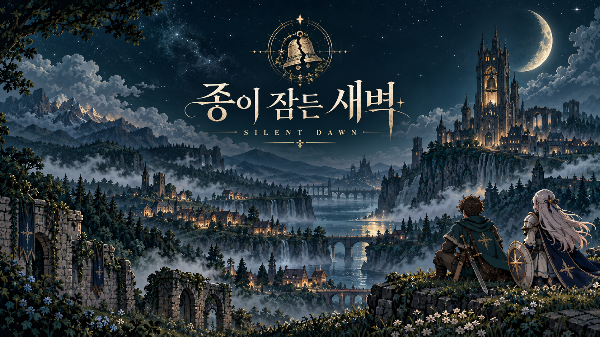
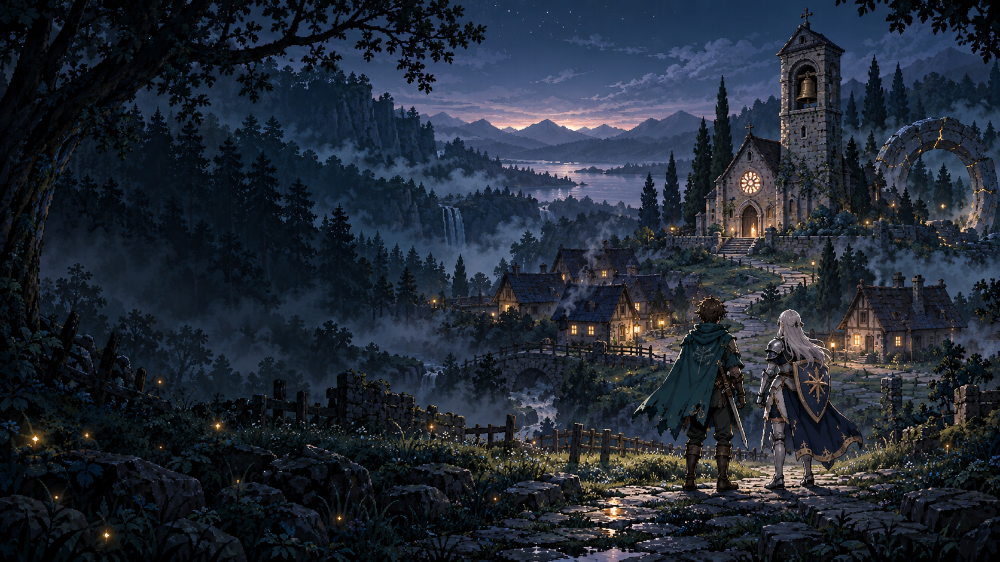

<div align="center">



# 종이 잠든 새벽
### SILENT DAWN

**종이 멈춘 밤, 두 사람의 약속이 깨어난다.**

한국어 스토리 · 2인 협동 · 픽셀 판타지 액션 RPG

[이야기](#종이-울리지-않는-밤) · [플레이](#두-사람이-만드는-전투) · [실행 방법](#시작하기) · [개발 기록](docs/PROGRESS.md)

</div>

---

## 종이 울리지 않는 밤

왕국의 아침은 태양이 아니라, 성당의 종소리로 시작된다.
그러나 에델 마을의 종이 멈춘 밤, 길 위에는 그림자 짐승이 나타났다.

이름 없는 방랑자와 부러진 검의 기사 **세리아**.
두 사람은 남겨진 주민들을 구하고, 마지막 종탑으로 향한다.
그곳에서 기다리는 것은 잃어버린 스승, 그리고 깨어나서는 안 될 진실이다.

> 새벽을 되찾기 위해 울린 종은, 무엇을 깨우게 될까.

## 두 사람이 만드는 전투

| 시스템 | 플레이 경험 |
| :--- | :--- |
| **혼자서도, 함께도** | AI 세리아와 바로 시작하거나 방 코드로 친구와 2인 협동 |
| **3연격과 고유 기술** | 기본 공격을 이어 강한 마무리 타격. 방랑자의 서광 베기와 세리아의 성역 |
| **협동 공명** | 같은 적을 번갈아 공격해 공명 충전. 다음 스킬로 추가 피해와 파티 회복 |
| **보고 피하는 전투** | 붉은 공격 예고, 회피 무적, 공격 준비 취소, 쓰러진 동료 구조 |
| **함께 여는 이야기** | 두 봉인석을 나누어 활성화하고, 두 사람 모두 대화를 읽으면 진행 |

**프롤로그 흐름**

이야기의 시작 → 주민 3명 구출 → 두 봉인석 → 수호기사 레온 → 마지막 종소리

## 이번 업데이트

- **타이틀 키아트** — 소개 배너와 별도로 에델 마을 컨셉아트를 제작. 시작 화면은 배경·제목·메뉴를 분리해 모바일 가독성 개선.
- **전투 자세 8종** — 준비·타격·고유 스킬·회피를 구분하는 캐릭터 연출.
- **전투 리듬** — 3연격, 회피 잔상, 동료와 함께 쌓는 공명 게이지.
- **아트** — 캐릭터·초상·주민·보스·건물·나무 등 게임용 PNG 24종.



타이틀 이미지는 소개용 키아트입니다. 플레이 화면의 그래픽을 그대로 촬영한 스크린샷이 아닙니다.

## 시작하기

**Node.js 22 이상**이 필요합니다. 게임 실행에는 별도 런타임 패키지 설치가 필요 없습니다.

```sh
git clone https://github.com/jinjwon/silent-dawn.git
cd silent-dawn
npm start
```

브라우저에서 **http://localhost:4177**을 여세요. macOS에서는 `플레이.command`를 더블클릭해도 됩니다.

**친구와 플레이:** 한 사람이 방을 만들고 다른 사람이 6자리 코드로 참가합니다. 같은 Wi-Fi의 휴대폰은 `http://서버컴퓨터의로컬IP:4177`로 접속합니다. 서버 컴퓨터가 켜져 있어야 합니다.

현재는 로컬·동일 네트워크용 프로토타입입니다. GitHub 저장소에 코드를 올리는 것만으로 공개 온라인 게임 서버가 운영되지는 않습니다.

### 조작

| 행동 | 키보드 | 모바일 |
| :--- | :--- | :--- |
| 이동 | WASD / 방향키 | 왼쪽 패드 |
| 기본 공격 | J · 길게 누르기 가능 | 공격 버튼 |
| 고유 스킬 / 충전된 공명 발동 | K | 별 버튼 |
| 회피 | Space | 회피 버튼 |
| 주민 구출 / 동료 부활 | E | 근처 상호작용 버튼 |
| 대화 진행 | Enter / Space | 다음 |
| 설정 | Escape | 설정 아이콘 |

## 구현 상태

**구현됨:** 솔로 프롤로그 완주, 2인 방·공유 상태, 대화·구출·퍼즐·보스·결말, AI 동료, 전투 모션·공명, 터치 및 키보드 조작.

**남은 작업:** 실제 휴대폰 2대의 지연·다중 터치 검증, 영구 저장과 새로고침 후 방 복귀, 공개 HTTPS 서버, 전 방향 연속 애니메이션, 후속 챕터.

진행은 서버 메모리에 저장됩니다. 연결이 끊긴 동료는 약 6.5초 뒤 AI로 전환하며, 기존 페이지의 통신이 복구되면 조작을 돌려줍니다. 솔로 모드는 설정·기록 중 일시정지하고, 2인 모드는 계속 진행합니다.

## 개발과 검증

**Canvas + DOM UI · Node.js HTTP · SSE · 서버 기준 전투 계산**

```sh
npm ci              # 아트 가공 및 테스트 도구 설치
npm test            # 전투·스토리 완주·HTTP/SSE·아트 검사
npm run art:build   # 저장된 원본으로 게임용 도트 PNG 재가공
```

2026-10-03 기준 자동 테스트 **19개 통과**. 브라우저에서 시작·대화·필드·공격을 짧게 확인했습니다. 실제 모바일 기기 QA나 대규모 동시접속 검증을 뜻하지 않습니다.

## 기록과 크레딧

- [스토리 문서](docs/story/종이_잠든_새벽_스토리.md) — 세계관, 인물, 프롤로그와 후속 전개
- [전투 개선](docs/COMBAT-V3.md) — 수치, 공식 RPG 참고 자료, 구현 범위
- [아트 제작](docs/ART-V2.md) · [타이틀 제작](docs/TITLE-ART.md)
- [출처와 이용 조건](CREDITS.md) · [검증 기록](VALIDATION.md)

생성형 이미지로 제작한 오리지널 원화를 Sharp로 가공했습니다. 모든 픽셀을 손으로 그린 아트라고 주장하지 않습니다. 효과음은 Web Audio 합성음이며, 타 게임의 이미지·음원을 추출해 사용하지 않았습니다.
